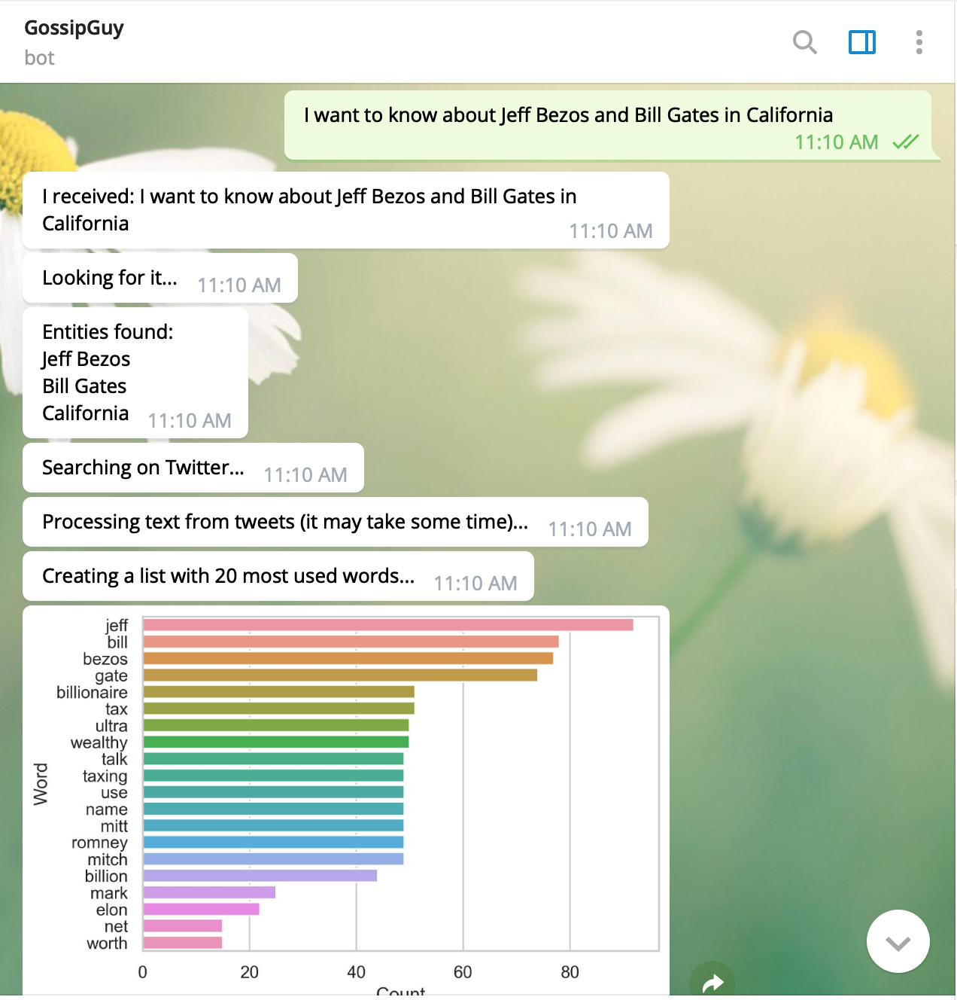

# chatbot_twitter_nlp
Script for creating a chabot that is able to receive a question and search about its related topics on Twitter.

This chatbot was implemented using five main libraries:

* telepot
Lib to interact with Telegram bots
* spacy
NLP lib used for NER (Named Entity Recognition)
* nltk
NLP lib used for tokenization stemming and removing stopwords
* gensim
NLP lib used for creating a Tf-idf model
* tweepy
Lib create a read-only connection with a Tweeter account

Other libraries were used for plotting graphs or (pre)processing the data

This chatbot receives a sentence as input and processes a NER using spacy for detecting names, organizations and locations. 
The next movement is to run a search on Tweeter looking for 1000 tweets containing all entities found in the last step. 
After that, a WordCloud and a barchart are generated with the most commom words found in the collected tweets. 
Finally, other graphs are plotted with the most important words in the tweets (using the Tf-idf model) and the most cited entities (applying NER on collected tweets).

These screenshots were taken from the execution of the bot Gossip Guy (gossip_guy_bot) created for this code. 

This bot will not anwser any calls because it is hosted in my machine and it is not running continuously. Please send me a message and I can run it for you for any tests or create a bot using Telegram's BotFather and insert your tweeter developer credentials.